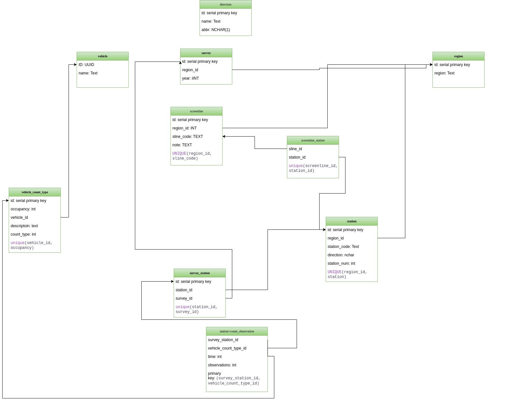

# CCDRS.Net
The 2022 re-implementation of CCDRs

# Building CCDRS
- Visual Studio 2022 with 17.4.0+
- Postgresql 14. We use the relational database postresql to store the data
- PgAdmin: A windows GUI application tool that can conenct to Postgresql. A useful tool to run queries and see the table relationships and displays errors, An alternative to writing queries in a terminal. 
- - MongoDb: This is only needed for local development to store the user name and passswords. In production mode there is no need to install mongodb on the production or test machines.
- AspNet Core Razor Web App We are using Razor pages to build the front end. 
- Ubuntu22 WSL2 VM Machine: On Windows 10 you will need to install Ubuntu 22 with WSL2 enabled. 
 

## Setting up Development Environment 
Note that these instructions are for setting up the system in Windows 10.

---
### Install and Setup Ubuntu WSL2

WSl2 is the Windows Subsystem for Linux to run Linux binaries on Windows. Ubuntu 22 is the operating system used for installing the PostgresSql and MongoDb databases and for deployment.
Please refer and follow the steps below in the link below on how to install Ubuntu for WSL2.
https://ubuntu.com/tutorials/install-ubuntu-on-wsl2-on-windows-10#1-overview

In some case you may need to upgrade WSL1 to WSL2 by installing the WSL2 kernel package as posted in the link below in the section.
This needs to be done otherwise MongoDb won't install and run properly. 
Note to install the latest version of Ubuntu which is version Ubuntu 22. 
- https://learn.microsoft.com/en-us/windows/wsl/install#upgrade-version-from-wsl-1-to-wsl-2
- https://learn.microsoft.com/en-us/windows/wsl/install-manual#step-4---download-the-linux-kernel-update-package

Open a terminal and switch to Ubuntu to open an Ubuntu terminal. To change directories insside the Windows machine
use ==/mnt/c==.

---
### Install and Setup PostgreSQl
Follow the links to install the latest version of Postgres on the Ubuntu 22 system
https://www.postgresql.org/download/linux/ubuntu/

#### Start and check Postgresql
Check the status of Postgresql to see if the Postgresql service is enabled and active
`sudo service postgresql status`
If the result displayed is **14/main (port 5432): down** then run the following command to 
enable and start the service
`sudo service postgresql start`

#### Change Postgres user password
By default Postgrse comes with a default admin user account called postgres however a password needs to be assigned to the default user.
This is required otherwise the AspNet core connection strings which connect to the database will fail to work. 
- In your linux terminal run the command `sudo -i -u postgres` to switch to the postgres account
- Run the command `psql` to acccess posgres inside your linux terminal 
- Inside the postgres termianl write the following command `ALTER USER postgres PASSWORD 'myPassword';` where myPassword is the password you choose to add. Remeber to add the semicolon at the end or the command will fail to load.
- Exit the psql clien by writing `\q` in the terminal. 

#### Install PgAdmin
Go to the main site of PgAdmin https://www.pgadmin.org/ and under the Download section download the version of PgAdmin required.
https://www.pgadmin.org/download/

---
### Install and setup MongoDb
 MongoDb is being used for user authentication. This database stores the username and passsword and setup similiar to the production system currently being 
 used and implemented. This step is required if the developer is working on code associated with user authentication otherwise
 it can be skipped. 

 Follow the steps on the official MongoDb website on installing and setting up MongoDb
 https://www.mongodb.com/docs/manual/tutorial/install-mongodb-on-ubuntu/

 #### Start and check Postgresql Service
 - run the command `$ sudo service mongodb status` to check the status of the service
 - if it displays ` * Checking status of database mongodb  [fail]` enable the service
 - run the command `sudo service mongodb start` to enable the postgresql service 
 - once the service is successfully running in the same terminal run the command `mongo` to run the service. Keep this terminal open
 - Open a second Ubuntu terminal and type in `mongo` to access the mongo shell
 
 #### Access Mongo shell to create database and single user entry
 - We need to create one database. inside the opened mongo shell type `use myshinynewdb` where myshinynewdb is the name
 of the database you wish to use. In the development environment it is called myshinynewdb.
 - Now create a collection with the single data entry of the username and password. This information will be 
provided by DMG upon request

`db.createCollection( Usertable,
   {
     username: <string>,
     password: <string>,
   }
)
`

You may need to restart the mongo service `sudo service mongodb restart` to see the updated changes

---
### Setup Solution to run the project
1. Git clone the repo and open it in Visual Studio. 
1. Right click on the project label CCDRS and click on the setting **Manager User Secrets**
    1. User secrets is a file where database connection strings can be safely stored and not publicly shared without being displayed to users or pushed to github
    1. in the User Secrets copy the following information to the system 

` {
  "AllowedHosts": "*",
  "ConnectionStrings": {
    "TestDBContext": "Server=localhost;Port=5432;Database=ccdrsv1;User Id=postgres;Password=yourpassword"
  },
  "MongoDB": {
    "ConnectionString": "mongodb://localhost:27017",
    "DatabaseName": "myshinynewdb",
    "UserCollectionsName": "UserTable"
  }
}
`
Where your password is the pasword to your postgres user account.
- save the secrets.json file and run the project by pressing F5 or Ctrl-F5. A successful load will display the login page.
- If you wish to disable login/authentication, open the file file Program.cs
-  comment out lines 47-56. These lines add authorization to the pages so by commenting them out authorization is disabled on these pages.
- `builder.Services.AddRazorPages(options =>
    {
        options.Conventions.AuthorizePage("/Index");
        options.Conventions.AuthorizePage("/AllStation");
        options.Conventions.AuthorizePage("/AllScreenline");
        options.Conventions.AuthorizePage("/SpecificStation");
        options.Conventions.AuthorizePage("/SpecificScreenline");
    }
);
`

## Setting up Production Environment

## Database Scripts
The database scripts are linux basch scrpits that are responsible for destroying the database 
and rebuilding the database from scratch.
The files are located in the CCDRS folder. 

The main file is called `CreateDatabase.sh` which performs the following actions 
1. cleans and deletes all tables in the database
1. rebuild the table schemas using the create table command
1. insert data back into the tables. This is done by either inserting table directly 
or creating temporary tables read from csv or txt files and then insert the data 
into the original table
1. database cleanup, typically deleting all temporary tables that were created. 

For screenline data, a python script exists to transform the data into a version that 
PostgresSQL copy command can work with.

**Note that it is important that no duplicate data exists in the text and csv files
because the transfering of data will then crash. Also it is important to note that no rows
are left blank**

## Database Architecture

The database architecture is now third normalized and consists of eleven tables as shown in
the figure below.
Note that due to PostgresSQL convention, all table names are lower cases and all foreign
keys end with _id.

##### direction
The direction table lists the four directions avaiable for the user to select. It stores the name
and the abbreviation of the direction e.g. 'North', 'N'. Note that the direction table is not 
associated or connected to any table, it is just used to display optiosn to the front end.

#### region
The region table lists every region available a user can search data for. It is also one
of the main primary tables as this table contains no foreign keys to any other table.

Inserting new regions into the database is done by opening the insert_reg-sur-dir.sql file
and adding the following lines to the end of the region section

`INSERT INTO region (name) VALUES('region_name');` where region_name is the name of the region you wish to add.

#### survey
The survey table contians a list of all the years asssociated with a given region.
The survey table has two attributes the year stored as an integer and a foreign key 
called region_id which points to the primary key of the region table.

Inserting new survey data is done by opening the insert_reg-sur-dir.sql file
and adding the following lines to the end of the survey section:

`INSERT INTO survey(year, region_id)VALUES(year_num, (select reg.id from  region  reg where reg.name='region_name'));`

where year_num is the year integer of the year to add and region_name is the name of the region
you wish to add to the  year too. As can be seen from the example below we added an integer of 2022 and the region_name
is equal to Toronto 
`INSERT INTO survey(year, region_id)VALUES(2022, (select reg.id from  region  reg where reg.name='Toronto'));`

#### 

---
# ToDo in Milestone 2 
- Add logging capabilities
- Add notes to the system. This means creating another database table, migratin the html code over
and then dipslaying the data to the front end

